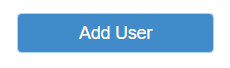

# Buttons

## Overview

This guide will show how to use buttons in your applications. See how easy it is to drag and drop buttons onto your forms and connect them to your business logic. Buttons can be modified, styled and even changed at runtime.

## Get Started

In the [Form Editor](broken-reference), drag the Button component from the Pallet onto the form.

<figure><figcaption><p>Add Button</p></figcaption></figure>


If the component does not appear in the pallet, it means you do not have the Bootstrap Components package installed. Click "Get more components" at the top of the pallet to open the [Servoy Package Manager](broken-reference) and install it.


## Modifying a Button at Design-Time

Buttons, like all components, have properties which can be modified at design-time to set the appearance and behavior of the component. Select the button in the [Form Editor](broken-reference) to see a list of properties in the [Component Properties Editor](broken-reference). Below are some common properties and how to set them at design-time.


See the reference docs for [Button](broken-reference) for a complete list of its [properties](broken-reference).


### Setting the Text

The text displayed on a button can be modified by setting its [`text`](broken-reference) property. Most often, this will just be plain text, such as "Submit" or "Cancel". In this case, just enter the value into the editor or directly on the component by double-clicking it. For more options open the [Text Property Editor](broken-reference).

### Setting a Tooltip message

Buttons, like many components, can display tooltip messages when a user hovers their cursor. Most often, this will just be plain text that describes what will happen on-click. In this case, just enter the value into the editor. For more options open the [Text Property Editor](broken-reference).

<figure><figcaption></figcaption></figure>


Remember that text can also be dynamic, data-driven[^1] or localized. For more options, you can open edit the text property in the [Text Property Editor](broken-reference).


### Setting an Image / Font-Icon

Many times, a button will be decorated with an image or font icon. To add an image to your button, edit the [`imageStyleClass`](broken-reference) property and choose the image style class of the font icon you wish to use. For example, enter a value of `fa fa-user-plus` to get a nice "Add User" icon.

<figure><figcaption></figcaption></figure>

For more information, please see the [Font Icon](../../styling-and-themes/font-icons.md) section of the giude on [Styling and Themes](../../styling-and-themes/).

### Styling

Like all components, a Button has a button can be styled using themes, variants and raw CSS. To apply any available style class, simply enter one or more space-delimited values for the `styleClass` property.

For example, `styleClass="btn btn-default btn-primary"`

#### Button Variants

If you are using Variants[^2], then you can easily drag and drop variations of your button onto your form.

<figure><figcaption><p>Button Variant being dropped on a form</p></figcaption></figure>

## Handling Events

Like most components, Buttons have events, which allow you to execute some logic when something happens in the UI. Of course, the most common event for a button is the `onAction` event, which is triggered when the button is clicked or the user hits the `Enter` key while the button has focus.

To Handle the event, double-click the value for the `onAction` property in the [Properties Editor](broken-reference). You will see the [Method Selection Wizard](broken-reference). You'll have the option select an existing Method or create a new Method. The method will be called when the button's `onAction` event is fired and the [Event](broken-reference) object will be passed to it.

<figure><figcaption><p>Create a method t handle the onAction event</p></figcaption></figure>

```javascript
/**
 * @param {JSEvent} event
 *
 * @properties={typeid:24,uuid:"A74C281C-00AA-46AA-BB38-500C937F2D1A"}
 */
function onAction(event) {
	// Enter custom code
}
```


See the [Button reference](broken-reference) for comprehensive list of [all events](broken-reference)


## Modifying a Button at Runtime

Buttons, like many components, can be modified at runtime through code. Below are a few examples of controlling a Button from code.

### Enabling / Disabling a button

You can easily change the `enabled` state of a Button at runtime.

```javascript
function disableButton(){
	elements.myButton.enabled = false;
}
```

### Hiding/Showing a Button

You can easily change the `visible` state of a Button at runtime.

```javascript
function hideButton(){
	elements.myButton.visible = false;
}
```

## Calling Button API Methods

Like most components, a Button has API methods which can be called from code. Below is an example of common API calls.

### Give Keyboard Focus

You can easily give keyboard focus to a button using the [`requestFocus`](broken-reference) method.

```javascript
function focusButton(){
	elements.myButton.requestFocus();
}
```


See the [Button Reference Docs](broken-reference) for a complete list of programmable [properties](broken-reference) and [methods](broken-reference).


## Related Articles

The following articles are recommended for additional reading:

* [Button Reference Documentation](broken-reference)
* [Styling and Themes](../../styling-and-themes/)
* [Scripting the UI](../../../programming-guide/scripting-the-ui/)

1. Anywhere you show text, it can be translated and localized to the users language. For more information, read our guide on Multi-Language Support

[^1]: Anywhere text is displayed, it can be substituted and merged with the data in context. For more information read about the [Text Property Editor](broken-reference)

[^2]: [Variants](../../styling-and-themes/component-variants.md) are pre-styled variations of components. You can create variants using theme properties and CSS and they will be available to quickly add to your forms. For more information, see the guid on [Styling and Themes](../../styling-and-themes/).
