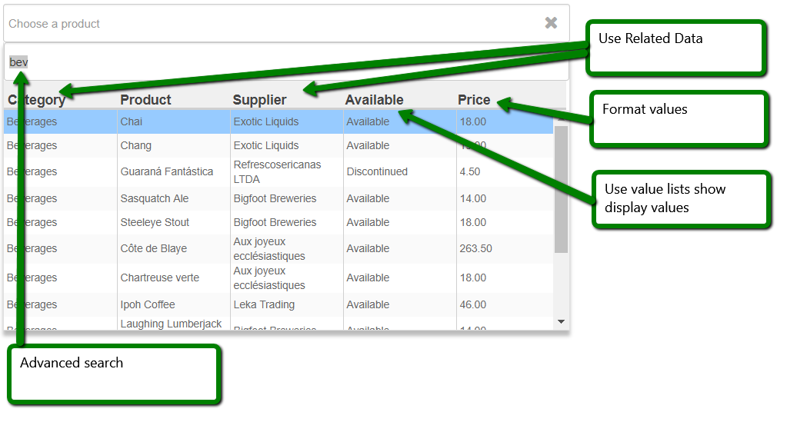
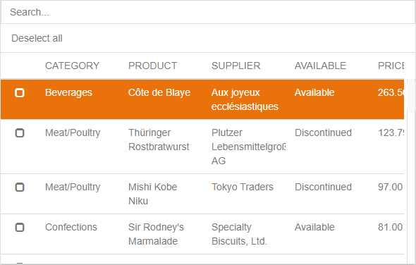

# svyLookup

* [Overview](./#overview)
* [Example](./#example)
* [Quick Start](./#quick-start)
  * [Show Lookup](./#show-lookup)
  * [Handle selection in callback](./#handle-selection-in-callback)
  * [Multi Select Lookup](./#multi-select-lookup)
  * [Lookup Types](./#lookup-types)
  * [Lookup DataProvider](./#lookup-dataprovider)
  * [Lookup Parameters](./#lookup-parameters)
  * [Filter Lookup List](./#filter-lookup-list)
  * [Create Lookup from Valuelist](./#create-lookup-from-valuelist)
  * [Create Lookup from Custom Query](./#create-lookup-from-custom-query)
  * [Restore Selection](./#restore-selection)
  * [Lookup Templates](./#lookup-templates)

### Overview

The svyLookup module provides a UX pattern for quickly finding and returning records within PopUp or Dialogs. It is similar to a type-ahead field, filtering the list of available selection as the user types, but allows for an extended UI, multi-selection searching and data-binding. Differently from the type-ahead field allows to show listed items within a sortable grid with multiple columns.

This module provides out-of-the-box grid implementation templates, but is also extensible to allow for other UI types and templates.

This [**quick screencast**](https://www.screencast.com/t/fxtRsOho) shows the example

### Example



**Key Features**

* [Advanced search](../home-5.md)
* Multi-Select or Single-Select
* Use Related Data
* Format Values
* Style Values
* Valuelist to show display values in grid
* Custom Templates
* PopUp or Dialogs

### Quick Start

It takes just a few lines of code to configure and show a robust lookup component. The selected record can be handled in a callback.

#### Show Lookup

The svyLookup module provide easy to use API to create and program Lookup objects bound to any dataSource. LookupFields are added defining the data to be visualized in the lookup grid and the searchable data. When the lookup is shown as a non-modal dialog, the selected records are returned in a callback function;

```
       // create lookup object
	var lookupObj = scopes.svyLookup.createLookup(datasources.db.example_data.products.getDataSource());
	
	// add fields
	
	// related data is supported
	lookupObj.addField('products_to_categories.categoryname').setTitleText('Category');
	lookupObj.addField('productname').setTitleText('Product');
	lookupObj.addField('products_to_suppliers.companyname').setTitleText('Supplier');
	
	// Valuelists and non-searchable fields supported
	lookupObj.addField('discontinued')
		.setTitleText('Available')
		.setSearchable(false)
		.setValueListName('product_availability');
		
	// calculation, non-searchable fields example (if (discontinued) return 'Discontinued' else return 'Available')
	// lookupObj.addField('isDiscontinued')
	//	.setTitleText('Available')
	//	.setSearchable(false)
		
	// formatted, non-searchable field example
	lookupObj.addField('unitprice')
		.setSearchable(false)
		.setTitleText('Price')
		.setFormat('#,###.00')
	
	// show pop-up
	var component = elements.productID;
	var initialValue = application.getValueListDisplayValue(elements.productID.getValueListName(),selectedProductID);
	lookupObj.showPopUp(onSelect,component,null,null,initialValue);
```

#### Handle selection in callback

The selected records are returned in the selection callback; if the lookup DataProvider has been set the selected values will also be returned in the callback.

```

	/**
	 * @param {Array<JSRecord>} records the selected records
	 * @param {Array<String|Date|Number>} values the selected values (available only if LookupDataProvider has been set)
	 * @param {scopes.svyLookup.Lookup} lookup the original lookup object
	 */
	function onSelect(records, values, lookup){
		if (records && records.length){
			selectedProductID = records[0].productid;
		} else if (records && !records.length) {
			// if records array is empty no value has been selected
			selectedProductID = null;
		}
	}
```

#### Multi Select Lookup

For multi-selection simply set the MultiSelect flag to true

```
       // create lookup object
	var lookupObj = scopes.svyLookup.createLookup(datasources.db.example_data.products.getDataSource());
	lookupObj.setMultiSelect(true);
        ...

```



#### Lookup Types

The Lookup can be shown as a PopUp, Modal and Non-Modal Window; PopUp and Window can be customized to best suit your experience.

Show as Default Popup

```
	// show as PopUp
	lookupObj.showPopUp(onSelect, target, width, height);
```

Show as Custom PopUp

```
	// show as custom PopUp
	var popup = lookupObj.createPopup(onSelect);
	popup.showBackdrop(true);
	popup.show();
```

Show as Default Modal Dialog

```
	// show as Modal Dialog, selected records are directly returned as result
	var records = lookupObj.showModalWindow();
```

Show as Custom Dialog

```
	// show as custom non modal dialog
	var win = lookupObj.createWindow(x, y, width, height, JSWindow.DIALOG)
	win.undecorated = false;
	win.title = "Product Lookup"
	lookupObj.showWindow(win, onSelect)
```

#### Lookup DataProvider

The Lookup DataProvider can be optional set to get direct access to the desired selected values for a quicker access to the desired selection. If the Lookup is shown as a modal window, which directly returns the selection instead of triggering a callback, the selected values will be returned instead of the selected records.

```
        // create lookup object
	var lookupObj = scopes.svyLookup.createLookup(datasources.db.example_data.products.getDataSource());
	
	// Set the lookup dataprovider
	lookupObj.setLookupDataProvider("productid");

	// add lookup field
	lookupObj.addField('productname').setTitleText('Product');

	// show lookup in modal window
	var values = lookupObj.showModalWindow();

	// handle selection
	if (values&& values[0]){
		selectedProductID = values[0];
	}

```

Example of Lookup DataProvider using non-modal window.

```
       // create lookup object
	var lookupObj = scopes.svyLookup.createLookup(datasources.db.example_data.products.getDataSource());
	
	// Set the lookup dataprovider
	lookupObj.setLookupDataProvider("productid");

	// add lookup field
	lookupObj.addField('productname').setTitleText('Product');

	// show lookup
	lookupObj.showPopUp(onSelect, elements.productid);

	// handle selection in callback method
	function onSelect(records, values, lookup){
		if (values&& values[0]){
			selectedProductID = values[0];
		}
	}

```

#### Lookup Parameters

Optionally custom parameters can be added to the lookup object; custom parameters can be retrieved in the selection callback from the lookup argument. Note that custom parameters do not have any effect to the lookup itself, are simply used to pass additional information to the selection callback.

```
	// create lookup object
	var lookupObj = scopes.svyLookup.createLookup(datasources.db.example_data.products.getDataSource());
	lookupObj.setLookupDataProvider("productname");

	// custom param, define to which dataprovider the lookup result should be assigned
	lookupObj.addParam({resultDataProvider: "productfk"});
	lookupObj.showPopUp(onSelect, elements.productfk);

	function onSelect(records, values, lookup) {
		if (values && values.length) {
			var resultDataProvider = lookup.getParams()[0].resultDataProvider;
			foundset[resultDataProvider] = values[0];
		}
	}

```

#### Filter Lookup List

You would like to be able to filter the data shown in the lookup list; you can filter the data by creating the lookup object with a filtered Foundset.

```
	// filter product foundset with unitprice > 30
	var filteredFS = datasources.db.example_data.products.getFoundSet();
	filteredFS.addFoundSetFilterParam("unitprice",">","30","unitprice");
	filteredFS.sort("unitprice desc");
	filteredFS.loadAllRecords();

	// create lookup object with filtered foundset
	var lookupObj = scopes.svyLookup.createLookup(filteredFS);
```

#### Create Lookup from Valuelist

Is possible to show in a lookup the same items of a Servoy Valuelist; to do so you can create a lookup from a valuelist; the lookup will show the displayValues and return the selected realValues into the _values_ argument of the select callback.

**NOTE**: Valuelist based on a database _relation_ are allowed only if the relation is a global relation (relation items are either literal or scope/global variables).\
Custom valuelists can show up to **500** items in lookup.

```
// create the lookup using the valuelist productsTable
var lookupObj = scopes.svyLookup.createValueListLookup("productsTable", "Product");

// show the lookup
lookupObj .showPopUp(onSelect, elements.productid);

// handle selection
function onSelect(records, values, lookup) {
	var selectedLookupValues = values.length ? values[0] : null;
}
```

#### Create Lookup from Custom Query

Is also possible to create a lookup directly from a custom query.

```
    //distinct query for the value
    var qbSelect = datasources.db.example_data.order_details.createSelect();
    qbSelect.result.add(qbSelect.joins.order_details_to_products.columns.productname, "productname");
    qbSelect.result.add(qbSelect.columns.productid, "productid");
    qbSelect.result.distinct = true;
    qbSelect.sort.add(qbSelect.joins.order_details_to_products.columns.productname);

    //create lookup and set form provider
    var lookupObj = scopes.svyLookup.createQueryLookup(qbSelect, 'ordered_products');
    
    //set proper header title for field
    var lookupField = lookupObj .getField(0);
    lookupField.setTitleText("Product");
    
    // show the lookup
    lookupObj.showPopUp(onSelect, elements.productid);

    // handle selection
    function onSelect(records, values, lookup) {
	var selectedLookupValues = records.length ? records[0].productid : null;
    }
```

#### Restore Selection

In case of multi select lookup is a common requirement to keep the last selected items in lookup, so the second time the user will access to the lookup he can still keep his latest selection. If you re-use the same lookup object will remember the last selection; if you instantiate a new lookup object instead will have a clear state with no selection.

Is possible to restore the last selection programmatically by using the lookup APIs _setSelectedRecords(records)_, _setSelectedPks(pks)_ or _setSelectedValues(values)_; the latter can be used only if a Lookup DataProvider has been set.

Restoring the last selection is particularly useful to restore user's selection after a new login session.

**NOTE**: restoring the selection is applicable only for multi select lookup.

```
	// create lookup object
	var lookupObj = scopes.svyLookup.createLookup(datasources.db.example_data.products.getDataSource());
        lookupObj.setSelectedPks([3,10,34]);
```

#### Lookup Templates

The module provides out-of-the-box grid implementation templates, but is also extensible to allow for other UI types and templates. Every template offers a custom implementation as a Servoy Form extending the abstract form _AbstractLookup_ It provides 4 out-of-the-box templates

* svyLookupTable : Default template with single selection table. The Table in lookup form is based on the Servoy Extra Table component.
* svyLookupNGTable : Variant of the single selection table build with the NG Grid
* svyLookupTableMulti : Default template with multi selection table. The Table in lookup form is based on the Servoy Extra Table component
* svyLookupNGTableMulti : Variant of the multi selection table build with the NG Grid

The template to be used in lookup can be set with the method setLookupForm.

```
	// create lookup object
	var lookupObj = scopes.svyLookup.createLookup(datasources.db.example_data.products.getDataSource());
	
	// set template
	lookupObj.setLookupForm(forms.svyLookupNGTable);

	// create multi-select lookup object
	var lookupObj = scopes.svyLookup.createLookup(datasources.db.example_data.products.getDataSource());
	lookupObj.setMultiSelect(true);

	// set multi-select template
	lookupObj.setLookupForm(forms.svyLookupNGTableMulti);

```

You can also use your custom lookup templates using the _setLookupForm_ method; check the wiki page [Custom Templates](custom-templates.md) to learn how to create a custom template.
