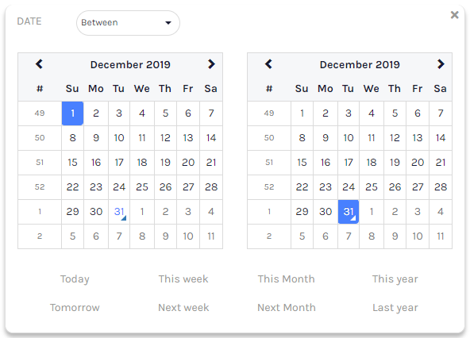
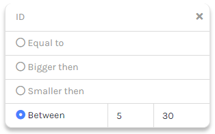
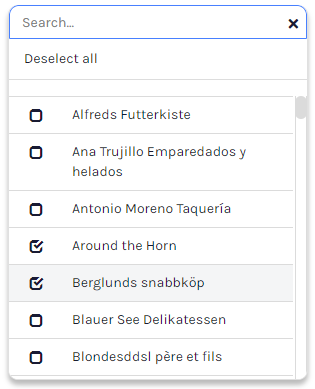
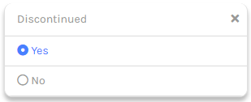

# Simple Filter Pickers

The popup filters in use by the filter toolbar can also be used as stand-alone simple filters and pickers. The scope _svyPopupFilter_ provides UX patterns with a variety of PopUp/Dialog pickers such as _dates range_ picker, _number range_ picker and _multi-select_ picker.

The module provides out-of-the-box implementation templates for the PopUp/Dialog pickers, but is also extensible to allow for other UI types and templates.

The simple filters are meant to be used as pickers for filtering whether the toolbar filter is not a viable approach; while the toolbar filter is great used in conjunction with the NG Grid, there can be several scenario where an NG Grid cannot be used to configure your filters toolbar; you would still like to use advanced filtering pattern, a common use case is to filter data in charts or in other grid types then the NG Grid. Other possible use cases for the simple filters are stand-alone pickers to be used in the logic of your form (.e.g pick arrival and return date of a route).

### Available Templates

#### Date Range

Pick a range of dates between, before or after the selected date/s; it returns respectively the selected value/s as:

* \[dateFrom, dateTo]
* \[beforeDate]
* \[afterDate]



#### Integer or Number Range

Pick a range of Number between, smaller or greater than the selected value/s; it returns respectively the selected value/s as:

* \[minValue, maxValue]
* \[maxValue]
* \[minValue]



#### Tokens

Pick a list of free-text tokens; the entered tokens are returned as an array of String values,


#### Multi Select

Pick a list of multiple options; the selected values are returned as an array. The Multi Select picker is based on the [svyLookup](../home-2/) module.



#### Check

Pick an option between "Yes" and "No"; the selected value is returned as 1 or 0.



### Quick Start

It takes just a few lines of code to configure and show a stand-alone filter picker. The selected values and operator can be handled in a callback. There are 4 types of filter picker: DateFilter, NumberFilter, TokenFilter and SelectFilter.

**Show Filter Picker**

```
	// create the popup filter
	var datePicker = scopes.svyPopupFilter.createDateFilter();
	
	// set selected values
	datePicker.setValues([foundset.shippeddate, foundset.requireddate]);
	
	// show the picker
	datePicker.showPopUp(onPickerSelect, elements.shippeddate);
```

**Handle selection in callback**

The selected values and the selected operator are returned in the selection callback respectively as an Array and as a String which is one of scopes.svyPopupFilter.OPERATOR enum values.

```
function onPickerSelect(values, operator, filterPicker) {
	foundset.shippeddate = values[0];
	foundset.requireddate = values[1];
}
```

#### SelectFilter type

The Select filter type constructor requires a [svyLookup](../home-2/) object and a dataprovider which will be used as [Lookup DataProvider](../home-2/#lookup-dataprovider). Rather than providing a new implementation for a single or multi-select pattern the SelectFilter type wraps the Lookup object in th SvySelectFilter object;

#### PopUp/Dialog Types

Any filter picker can be shown as a PopUp, Modal and Non-Modal Window; PopUp and Window can be customized to best suit your experience.

Show as Default Popup

```
	// show as PopUp
	filterObj.showPopUp(onSelect, target, width, height);
```

Show as Custom PopUp

```
	// show as custom PopUp
	var popup = filterObj.createPopup(onSelect);
	filterObj.showBackdrop(true);
	filterObj.show();
```

Show as Default Modal Dialog

```
	// show as Modal Dialog
	filterObj.showModalWindow();
	var operator = filterObj.getOperator();
	var values = filterObj.getValues();
```

Show as Custom Dialog

```
	// show as custom non modal dialog
	var win = filterObj.createWindow(x, y, width, height, JSWindow.DIALOG)
	win.undecorated = false;
	win.title = "My Filter Picker"
	filterObj.showWindow(win, onSelect)
```

#### Default Selection

Is it possible to set and get the filter selection for it's values and operator programmatically; the operator can be one of the values of the scopes.svyPopupFilter.OPERATOR enum; note that some operators may not be applicable for certain filter types. For example the Token filter type support only the operator scopes.svyPopupFilter.OPERATOR.IS\_IN.

```
	// create the popup filter
	var filterObj = scopes.svyPopupFilter.createDateFilter();
	
	// set selected values
	filterObj.setValues([foundset.shippeddate, foundset.requireddate]);

	// set selected operator
	filterObj.setOperator(scopes.svyPopupFilter.OPERATOR.BETWEEN);

	// show the picker
	filterObj.showPopUp(onSelect, elements.shippeddate);
```

#### Persist Filter State

The state of every single filter picker can be persisted into a serializable JSON object and can be restored any moment using the filter object API.

```
	// persist the filter state
	var filterState = datePicker.getState();
	application.setUserProperty('filter-picker-1', JSON.stringify(filterState));

	// restore the filter state
	var filterState = application.getUserProperty('filter-picker-1');
	datePicker.restoreState(JSON.parse(filterState));
```

#### Filter Picker Parameters

Optionally custom parameters can be added to the filter picker object; custom parameters can be retrieved in the selection callback from the filter argument. Note that custom parameters do not have any effect to the picker itself, are simply used to pass additional information to the selection callback.

```
	// create the popup filter
	var filterObj = scopes.svyPopupFilter.createDateFilter();
	
	// set selected values
	filterObj.setValues([foundset.shippeddate, foundset.requireddate]);

	// custom param, define to which dataprovider the picked result should be assigned to
	filterObj.addParam({dateFromDataProvider: "shippeddate", dateToDataProvider: "requireddate"});
	
	// show the picker
	filterObj.showPopUp(onSelect, elements.shippeddate);

function onSelect(values, operator, filter) {
	// get the custom param
	var param = filter.getParams()[0];
	
	// retrieve from the custom param the dataproviders the result should be assigned to
	foundset[param.dateFromDataProvider] = values[0];
	foundset[param.dateToDataProvider] = values[1];
}
```

#### Filter Picker Templates

The module provides out-of-the-box implementation templates for the PopUp/Dialog pickers, but is also extensible to allow for other UI types and templates. Every template offers a custom implementation as a Servoy Form extending one of the _Abstract_ forms (depending from the filter type).

The template to be used by filter object can be set with the method _setRendererForm_.

```
	// create the popup filter
	var datePicker = scopes.svyPopupFilter.createDateFilter();
	
	// set popup template form
	datePicker.setRendererForm(forms.customDatePopupFilter);
	
	// show the picker
	datePicker.showPopUp(onSelect, elements[event.getElementName()]);
```

You can learn more on custom templates in the dedicated [wiki](custom-templates.md) section.
